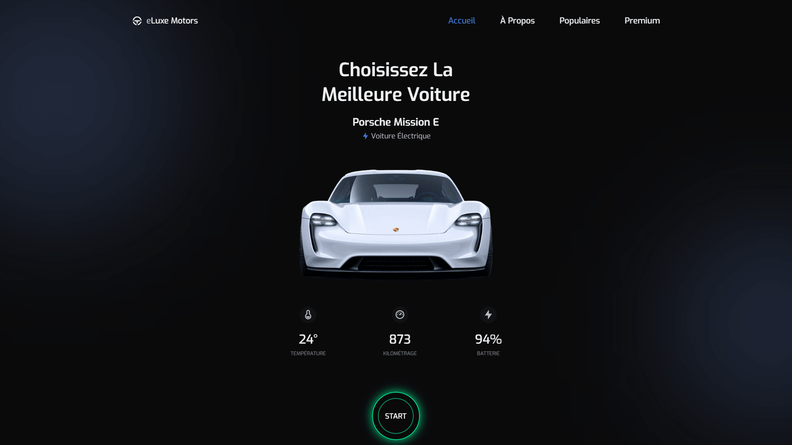

<div align="center">  
    <a href="https://electric-car-store-vm.netlify.app/" target="_blank">  
        
    </a>
    </br>  
    </br>  
  <h3 align="center">🔋 eLuxe Motors &nbsp; — &nbsp; Voitures Électriques de Luxe</h3>  
</div>

## <br /> 📌 Sommaire

&nbsp;&nbsp;&nbsp; 🎨 &nbsp; [**Introduction**](#introduction)<br />
&nbsp;&nbsp;&nbsp; 🛠️ &nbsp; [**Technologies**](#technologies)<br />
&nbsp;&nbsp;&nbsp; 🎯 &nbsp; [**Fonctionnalités**](#fonctionnalités)<br />
&nbsp;&nbsp;&nbsp; 🚀 &nbsp; [**Installation**](#installation)<br />

## <br /> <a name="introduction">🎨 Introduction</a>

eLuxe Motors est une landing page immersive mettant en avant les modèles haut de gamme de voitures électriques Porsche, Tesla et Audi. Avec un design sombre, un filtrage dynamique des véhicules et des animations élégantes, ce site est idéal pour des projets automobiles premium ou des vitrines de marques modernes.

## <br /> <a name="technologies">🛠️ Technologies</a>

- HTML5 sémantique et structuration claire
- CSS3 moderne avec variables, media queries et animations
- JavaScript ES6 clair et modulaire
- [Swiper.js](https://swiperjs.com/) pour les carrousels populaires
- [MixItUp](https://github.com/patrickkunka/mixitup/) pour le filtrage dynamique
- [ScrollReveal](https://scrollrevealjs.org/) pour des animations au scroll
- [Remix Icons](https://remixicon.com/) pour des icônes vectorielles modernes
- Responsive Design pensé en mobile-first

## <br /> <a name="fonctionnalités">🎯 Fonctionnalités</a>

- Landing page animée en full dark mode
- Carrousel Swiper.js des modèles Porsche populaires
- Section Premium filtrable de Porsche, Tesla et Audi
- Scroll dynamique avec lien actif sur le menu
- Boutons d’achat sur chaque fiche produit
- Menu mobile responsive avec animation
- Logos constructeurs affichés dans un bandeau
- Animations fluides au scroll avec ScrollReveal
- Formulaire d’abonnement aux offres spéciales
- Mise en page responsive mobile-first

## <br /> <a name="installation">🚀 Installation</a>

### ✅ Prérequis

- [Google Chrome](https://www.google.com/) &nbsp;—&nbsp; Navigateur moderne
- [Visual Studio Code](https://code.visualstudio.com/) &nbsp;—&nbsp; Éditeur de code
- [Live Server](https://marketplace.visualstudio.com/items?itemName=ritwickdey.LiveServer) &nbsp;—&nbsp; Extension VS Code

### 📥 Cloner le projet

```bash
git clone git@github.com:ValentinMadiot/electric-car-store_ui
cd electric-car-store_ui
```

### ▶️ Lancer le projet

Il suffit d’ouvrir le fichier `index.html` dans un navigateur, ou d’utiliser l’extension **Live Server** sur VS Code pour un aperçu dynamique.
